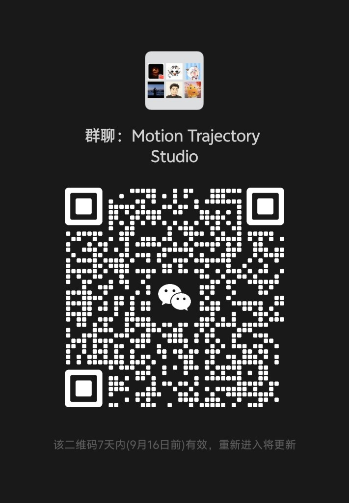
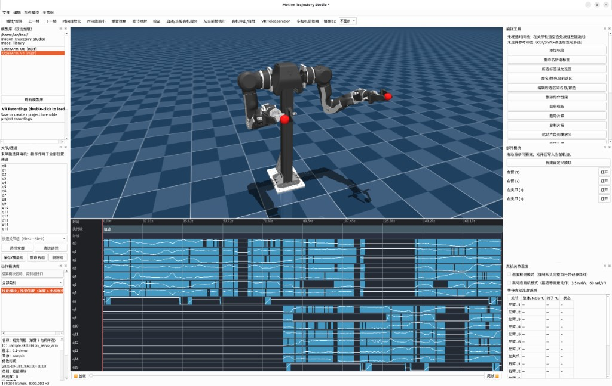

# Motion Trajectory Studio

[English](#english) · [中文](#中文)

## English

A model-independent desktop editor for sampled robot motion trajectories, with
MuJoCo preview and an optional standalone OpenArm hardware playback service.
This is the open-source free edition: trajectory editing, part modules, and
hardware replay are included; VR teleoperation and the action/event module
system are not. Models, joint counts, channel names, and sample rates are not
hard-coded.


### Highlights

- Import MJCF/XML/URDF models and CSV/NPZ trajectories.
- Automatic or manual joint mapping with scale, offset, and joint limits.
- Real-time MuJoCo preview, named model cameras, direct V4L2/YUYV hardware
  camera display, frame stepping, zoomable/scrollable multi-track timeline,
  labels, named colored ranges, and undo/redo.
- Non-destructive trim, delete, copy/paste, loop, hold, speed change, quintic
  smoothing, high-speed phase smoothing, trajectory splice, and end-effector
  offset editing.
- Blank hold-pose trajectories and playhead keyframes for building motion from
  scratch.
- Continuity, NaN, jump, velocity, acceleration, joint-limit, mapping, and
  sampled collision validation.
- Portable `.motionproj` projects and `.tar.gz` bundles; source assets are not
  overwritten.
- Optional real-hardware playback from the current playhead, joint temperature
  monitoring (MOS and rotor), full-run temperature curves, and camera view.
- OpenArm O6 dexterous-hand editing: double-click `OpenArm_O6` for a rest pose,
  then use **Part Modules** sliders for the 6 actuated joints on each hand.

### Install and run

```bash
cd /path/to/motion_trajectory_studio
bash install.sh
bash run_en.sh       # English UI
bash run.sh          # 中文界面 / Chinese UI
```

The launcher also supports CLI commands:

```bash
./.venv/bin/python app.py doctor
./.venv/bin/python app.py inspect trajectory.csv --hz 250
./.venv/bin/python app.py validate project.motionproj
./.venv/bin/python app.py export project.motionproj result.csv --hz 100
./.venv/bin/python app.py pack project.motionproj project.tar.gz
```

`MOTION_STUDIO_LANG=en bash run.sh` is equivalent to `run_en.sh`. Both languages
use exactly the same editing, validation, and hardware implementation.

### Typical workflow

1. Import a robot model or double-click one in `model_library/`.
2. Import CSV/NPZ motion data and confirm channel-to-joint mapping.
3. Drag the segment lane to select a time range. Right-click the range to clear
   it; use the first/last-frame buttons for boundary navigation.
4. Apply edits, inspect the MuJoCo preview, and run validation.
5. Save a `.motionproj` or export CSV/NPZ.
6. For hardware, put the playhead at the required start frame, connect the
   standalone service, verify the workspace and emergency stop, then execute.

### Editing behavior

The joint/channel list controls an operation's scope. No selection means all
position channels. Copy only fills an internal clipboard; paste inserts at the
playhead. Ranges can be named and colored independently of joint track colors.
When a Part Module slider is committed with a time range selected, that motor
is written directly to the chosen value for every sample in the range. No
automatic boundary smoothing is added; apply quintic or high-speed smoothing
manually afterward where required. Use **New Custom Module** in the Part
Modules dock to name and combine any model motors into another reusable
control panel. Custom definitions are saved in the project and can be deleted;
built-in model modules remain read-only.

End-effector adjustment requires the red playhead within the selected range,
including either endpoint.
Mouse drag or the 6D teaching panel defines a Cartesian offset. The editor
smoothly enters that offset from the range start to the playhead, preserves it
through the selected range, and creates a short smooth exit after the range.
IK errors report the failing time/frame, phase, nearby named segment, pose
error, and implicated joint limits.

Use quintic smoothing for isolated jerks and ordinary transitions. Use
high-speed phase smoothing for periodic/high-frequency motion where phase and
speed should be preserved rather than slowed down.

### Hardware safety model

`hardware_controller/` is independent; this project does not modify or start a
sibling repository. The editor communicates over UDP using
load → prepare → execute. `prepare` selects the frame but does not move hardware.

At execute time, the service reads measured joints and creates an adaptive
rest-to-rest quintic transition of at least 3 seconds. It lengthens the
transition when required by configured limits, validates the complete sampled
transition, then strictly plays the exported position and velocity trajectory.
There is no online follower that reshapes the edited motion. MuJoCo plays the
same editor trajectory independently; hardware feedback is telemetry and does
not rewrite the simulation pose.

Hardware execution is safety-critical. Start with a short, low-energy segment,
keep the emergency stop reachable, and do not bypass a reported position,
velocity, acceleration, heartbeat, motor-fault, or temperature stop.

### Models and trajectory formats

Keep each model and its meshes/textures in one directory:

```text
model_library/MyRobot/
├── MyRobot.xml
├── meshes/
└── textures/
```

For ambiguous entry files, add `model.json`, for example
`{"entry": "description/main.urdf"}`. See `model_library/README.md`.

CSV requires a header. Time may be named `time`, `times`, `t`, `timestamp`,
`seconds`, or `sec`; without time data, provide a sample rate. NPZ accepts a
`times`/`time` vector plus one-dimensional channels, or a `positions`/`q`
matrix with optional `joint_names` and `hz`/`frequency_hz`.

To adjust bimanual timing, select the affected joints in the channel panel,
select a time range, then drag the body of the orange range to a stationary
empty interval. A green outline previews the destination. The move preserves
the total duration and all unselected joints. Partial overlap with the source
is allowed for small timing nudges; only the newly occupied portion must be
stationary. Incompatible or out-of-bounds destinations are rejected, and the
operation supports undo/redo.

Frequently used channel selections can be stored as joint groups below the
channel list. The first nine groups are assigned `Alt+1` through `Alt+9` in
their displayed order. Choosing a group or pressing its shortcut replaces the
current channel selection; groups can be overwritten, renamed, or deleted and
are stored in the project file.

Editing commands follow the same channel scope. With no explicit channel
selection, all position joints are used. With a subset selected, trim, delete,
hold, loop, copy/paste, retiming, smoothing, and clip movement operate only on
those joint lanes. Partial delete advances only the selected lanes and pads
their tail; partial hold delays only the selected lanes while other lanes keep
their original timing.

Real cameras are displayed in the separate **Multi-Camera Monitor** window,
opened from the main toolbar. Add multiple `/dev/videoN` devices and/or HTTP(S)
MJPEG sources; each panel connects independently, while Connect All and
Disconnect All manage the complete grid. Set a startup list with
`OPENARM_REAL_CAMERA_SOURCES=/dev/video0,/dev/video2,https://host/cam.mjpg`.

### Development

See [docs/ARCHITECTURE.md](docs/ARCHITECTURE.md) for module and safety
boundaries and [docs/DEPENDENCIES.md](docs/DEPENDENCIES.md) for the independence
audit. Automated coverage and hardware-dependent manual checks are listed in
[docs/TEST_MATRIX.md](docs/TEST_MATRIX.md). Run the full suite with:

```bash
./.venv/bin/python -m pytest
```

### Community

Scan the WeChat QR code to join the **Motion Trajectory Studio** group:

<p align="center">
  
</p>

The invite code currently shown expires on 16 September 2026; replace
`docs/images/wechat_group.png` when WeChat issues a new one.

## 中文

一个与具体模型无关的采样动作轨迹桌面编辑器，集成 MuJoCo 预览，并可选连接
独立的 OpenArm 真机回放服务。这是开源免费版：保留轨迹编辑、部件模块和真机回放，
不含 VR 遥控与动作/事件模块系统。模型、关节数量、通道名称和采样频率均不写死。



### 主要功能

- 导入 MJCF/XML/URDF 模型和 CSV/NPZ 轨迹。
- 自动或手动关节映射，支持比例、偏移和关节限位。
- 实时 MuJoCo 预览、模型摄像机、V4L2/YUYV 真机相机、逐帧定位、可缩放/滚动
  多轨时间轴、标签、彩色命名选区及撤销/重做。
- 非破坏式裁剪、删除、复制/粘贴、循环、等待、变速、五次平滑、高速相位平滑、
  轨迹拼接和末端偏移编辑。
- 可从模型当前姿态新建空白保持轨迹，并在播放头写入生成器关键点。
- 连续性、NaN、跳变、速度、加速度、关节限位、映射及采样碰撞检查。
- `.motionproj` 可迁移工程和 `.tar.gz` 打包，不覆盖源素材。
- 可从当前播放头执行真机，实时显示关节 MOS/转子温度，记录完整温度曲线并显示
  真机相机。
- OpenArm O6 灵巧手编辑：双击 `OpenArm_O6` 生成静止姿态，在右侧「部件模块」
  打开左右手，用滑条调节每只手 6 个主动手指关节。

### 安装与启动

```bash
cd /path/to/motion_trajectory_studio
bash install.sh
bash run.sh          # 中文界面
bash run_en.sh       # English UI
./.venv/bin/python app.py doctor
```

也可通过 `MOTION_STUDIO_LANG=en bash run.sh` 启动英文界面。中英文完全共用编辑、
验证和真机实现，不维护两套易分叉的代码。

### 基本流程

1. 导入模型，或双击 `model_library/` 中的模型。
2. 导入 CSV/NPZ 轨迹并确认通道到关节的映射。
3. 在分段栏拖动创建时间选区；右键选区可取消，首帧/尾帧按钮用于快速定位边界。
4. 执行编辑、检查 MuJoCo 预览并运行验证。
5. 保存 `.motionproj` 或导出 CSV/NPZ。
6. 真机运行时，将红色播放头放到起始帧，连接独立服务，确认工作区和急停后执行。

### 编辑规则

左侧关节/通道列表决定操作范围；不选择表示全部位置通道。复制只写入内部剪贴板，
粘贴才会在播放头插入。命名选区及其颜色与各关节轨道颜色相互独立。
时间轴存在选区时，提交“部件模块”滑条会把该电机在选区内的每个采样点直接写成
滑条值，不自动处理首尾连续性；需要连续过渡时，由用户随后手动应用五次平滑或
高速相位平滑。右侧部件模块面板可新建自定义模块，填写名称并任意勾选模型电机，
生成新的组合控制面板；自定义模块随工程保存并可删除，内置模块不可删除。

末端调整要求红色播放头位于选区内（允许首帧或末帧）。鼠标拖拽或 6D 示教按钮确定笛卡尔偏移：
选区起点到播放头平滑进入偏移，之后整个选区保持该偏移，并在选区外增加短暂平滑
退出段。IK 失败会报告具体时间/帧、阶段、附近命名分段、位姿误差及相关关节限位。

普通抽动和一般衔接使用五次平滑；周期性高频动作优先使用“高速相位平滑”，避免
为满足静止边界而明显降速。

### 真机安全链路

`hardware_controller/` 是本项目内的独立服务。
编辑器通过 UDP 执行 `load → prepare → execute`；`prepare` 只选定起点，不会运动。

执行时服务读取真机实测关节，从当前状态生成不少于 3 秒的静止到静止自适应五次
过渡；如果限位需要会自动延长。完整过渡验证通过后，严格播放编辑器导出的位置和
速度样本，不在线改写已编辑轨迹。MuJoCo 独立播放相同的编辑器时间轴，真机反馈仅
用于遥测和安全监控。

真机执行具有实际风险。首次应使用短、低能量片段，保持急停可触达；遇到位置、
速度、加速度、心跳、电机故障或温度保护时，不要绕过保护继续运行。

### 模型、数据和开发

每个模型及其 mesh/纹理放入 `model_library/模型名/`。入口不明确时可添加
`model.json`，例如 `{"entry": "description/main.urdf"}`；详见
`model_library/README.md`。

CSV 第一行必须是列名；时间列支持 `time/times/t/timestamp/seconds/sec`，没有
时间列时需提供 Hz。NPZ 支持 `times/time` 加一维通道，或 `positions/q` 二维矩阵、
可选 `joint_names` 和 `hz/frequency_hz`。

调整双臂时序时，先在关节面板选择受影响关节，再框选时间段并拖动橙色选区主体
到这些关节保持静止的空白区；绿色虚线框用于预览落点。移动不会改变总时长或未选
关节。选区可以与原位置部分重叠，用于小幅提前或延后；系统只检查目标中新进入的
范围。越界及被其他运动占用的新增目标范围会被拒绝，并支持撤销/重做。

常用通道选择可在关节列表下方保存为关节组。按显示顺序，前九组自动分配
`Alt+1`～`Alt+9`；选择下拉项或按快捷键会直接替换当前通道选择。编组支持覆盖、
重命名和删除，并随工程文件保存。

编辑命令统一遵循关节选择范围：未选择通道时默认作用于全部位置关节；选择部分
通道后，裁剪、删除、等待、循环、复制粘贴、变速、平滑和片段移动都只作用于这些
关节轨道。局部删除只让所选轨道的后续动作前移并在末尾补保持；局部等待只延后
所选轨道，其他关节仍按原时序执行。

真机画面现在位于工具栏打开的独立“多相机监视器”窗口。可同时添加多个
`/dev/videoN` 设备和 HTTP(S) MJPEG 地址，每个画面独立连接，也可一键全部连接或
断开。启动时的默认列表可通过
`OPENARM_REAL_CAMERA_SOURCES=/dev/video0,/dev/video2,https://host/cam.mjpg`
设置。

模块及安全边界见 [docs/ARCHITECTURE.md](docs/ARCHITECTURE.md)，独立性审计见
[docs/DEPENDENCIES.md](docs/DEPENDENCIES.md)，自动测试范围及需要真机人工确认的
项目见 [docs/TEST_MATRIX.md](docs/TEST_MATRIX.md)。测试命令：

```bash
./.venv/bin/python -m pytest
```

### 交流群

微信扫描下方二维码加入 **Motion Trajectory Studio** 群聊：

<p align="center">
  
</p>

当前二维码有效期至 2026 年 9 月 16 日；过期后请更新
`docs/images/wechat_group.png`。
